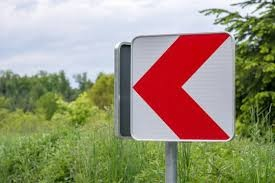
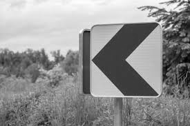
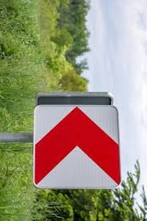
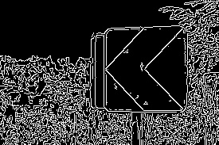

# Обработка изображений с помощью OpenCV (Windows)

Программа демонстрирует базовые операции обработки изображений с использованием библиотеки OpenCV на C++:
- преобразование в оттенки серого
- поворот на 90° по часовой стрелке
- изменение размера (уменьшение в 2 раза)
- размытие по Гауссу
- детектирование границ (Canny)

## Запуск программы

1. Убедитесь, что в папке с исполняемым файлом (или в системном PATH) присутствуют следующие DLL-файлы OpenCV:
   - `opencv_world480.dll`
   - `opencv_world480d.dll` (для отладочной сборки)
2. Запустите `main.exe`.
3. Появится стандартное диалоговое окно Windows для выбора изображения (поддерживаются форматы `.jpg`, `.jpeg`, `.png`, `.bmp`).
4. После выбора изображения откроется 6 окон с результатами обработки.
5. **Закройте все окна** (нажатием `×` или `Esc` в активном окне) - программа завершится и сохранит обработанные изображения **в ту же папку, где находится выбранное исходное изображение**, с именами:
   - `original.jpg`
   - `grayscale.jpg`
   - `rotated.jpg`
   - `resized.jpg`
   - `blurred.jpg`
   - `edges.jpg`

**Примечание:** программа работает только в Windows (используется WinAPI диалог выбора файлов).

## Результат работы

Ниже показаны примеры обработанных изображений.

| Результат |
|-----------|
|  |
|  |
|  |
|  |
|  |
|  |